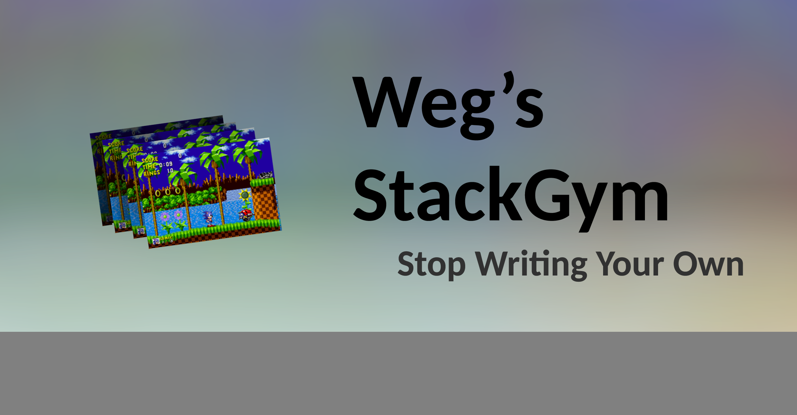

**Status:** Maintenance (expect bug fixes and additional algorithms)

 

# StackGym
Are you an avid deep reinforcement learning learner?
Are you tired of rolling your own framestacking util for openai-gym?
Did you not know about aigym's FrameStack wrapper? (which sucks btw.) 
Be tired no longer my friend. Introducing, the NEW StackGym wrapper class. 

Just provide a state formatter function in case you want to monochrome or shrink your input images, 
and presto, the StackGym wrapper class will automagically give you stacks of frames to work with.

By choosing StackGym you made life easy for yourself. Good job.

## Features
Unlike aigym's 'FrameStack', which sucks, StackGym:

    -can provide a stack with noncontiugous frames from a contiguous frame env
    -supports color images
    -lets you format the frames before they are stacked, so you don't have to unstack then format then restack...???
    -has simpler code
    -may add new handy features in the future

## Prerequisites 
StackGym requires python3, pytorch, and openai-gym, numpy.

## Installation
- Clone the repo or download stack_gym.py and drop it wherever you need it!

## Use

### Step 1: Import
```python
from stack_gym import StackGym
```

### Step 2: Make A Frame Formatter
```python
''' This is an example state formatter function. This will go between your environment and the buffer.'''
def squash_frame(state):
    state = state/255.0                                             #   normalize pixel values
    state = state.transpose((2, 0, 1))                              #   convert (width, height, color_channels) -> (color_channels, width, height)
    
    '''     RGB     ''' 
    states = [skimage.measure.block_reduce(state[channel], (2, 2), np.max) for channel in range(3)]
    state = np.stack(states)

    '''     GRAYSCALE       '''
    # state = state.mean(axis=0)                                    #   how to remove color
    # state = state[30:-20, 30:-30]                                 #   how to do cropping
    # state = skimage.measure.block_reduce(state, (2, 2), np.max)   #   how to half the dimensions
    # state = transform.resize(state, [64,64])                      #   how to resize more generally
    # state = Image.fromarray((state[0]*255).clip(0, 255)).show()   #   you might need this for visualization purposes
    
    '''     NON CONV        '''
    # state = state.flatten()                                       #   if for some reason you have a non convolutional network
    return state
```

### Step 3: Make A StackGym and use it like its a regular gym. Wow!
```python
''' This is an example training loop.'''
if __name__ == '__main__':
    FRAME_STACK_SIZE = 4
    NUM_COLOR_CHANNELS = 3
    WIDTH, HEIGHT = 48, 48
    STATE_SHAPE = (FRAME_STACK_SIZE * NUM_COLOR_CHANNELS, WIDTH, HEIGHT)    #   (4 * 3, 48, 48)
    agent = Agent(state_shape=STATE_SHAPE, num_actions=5,)
    env = StackGym(
        env=gym.make('CarRacing-v0'),
        frame_stack_size=FRAME_STACK_SIZE, 
        frame_skip_size=2,
        state_formatter=squash_frame,                               #   here is where you put your frame formatter
        rgb_data=True,
    )

    while True:
        done = False
        state = env.reset()
        while not done:
            env.render()

            action = agent.choose_action(state)
            state_, reward, done, info = env.step(action)               #   state comes out pre stacked. woohoo!
            agent.store_memory(state, action, reward, state_, done)     #   your memory will be storing stacks
            agent.learn()

            state = state_
```

## Future Features
```python
'''TODO:
    expose observation space
    expose state space
    expose all gym functions via meta python magic
'''
```

 -check example.py for this information offline
